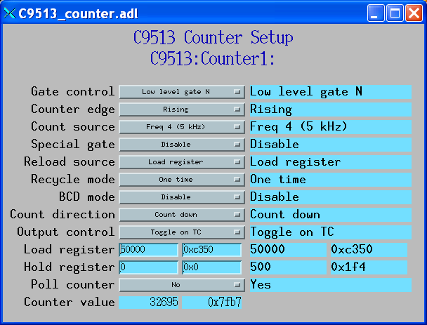
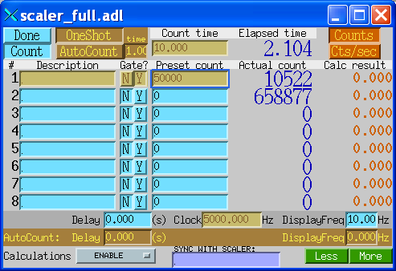

.. container::

   .. rubric:: Driver for the Measurement Computing CTS9513
      Counter/Timer Cards
      :name: driver-for-the-measurement-computing-cts9513-countertimer-cards

   .. rubric:: Including USB-4303, PCI-CTR10, CIO-CTR10, and PC104-CTR10
      :name: including-usb-4303-pci-ctr10-cio-ctr10-and-pc104-ctr10

   .. rubric:: December 5, 2014
      :name: december-5-2014

   .. rubric:: Mark Rivers
      :name: mark-rivers

   .. rubric:: University of Chicago
      :name: university-of-chicago

Table of Contents
-----------------

-  `Introduction <#Introduction>`__
-  `Configuration <#Configuration>`__
-  `Databases <#Databases>`__
-  `Wiring <#Wiring>`__

.. _Introduction:

Introduction
------------

*NOTE:* The Measurement Computing USB-4303 is no longer available. It
has been replaced with the USB-CTR04/08 which has higher performance and
more features.. See the documentation for the `EPICS measCompUSBCTR
driver <measCompUSBCTRDoc.html>`__ for more information.

This is an `EPICS <http://www.aps.anl.gov/epics>`__ driver for the
`USB-4303 <http://www.mccdaq.com/usb-data-acquisition/USB-4303.aspx>`__
counter/timer module from `Measurement
Computing <http://www.mccdaq.com>`__ The driver should also work with
other Measurement Computing devices that are based on the C9513,
including the discontinued PCI-CTR10, CIO-CTR10, and PC104-CTR10, but
this has not been tested. The driver is written in C++, and consists of
a class that inherits from
`asynPortDriver <http://www.aps.anl.gov/epics/modules/soft/asyn/R4-18/asynPortDriver.html>`__,
which is part of the EPICS
`asyn <http://www.aps.anl.gov/epics/modules/soft/asyn>`__ module.

.. container::

   .. rubric:: Photo of USB-4303
      :name: photo-of-usb-4303

   |USB-4303.jpg|

This module has the following features:

-  Counter/Timers

   -  2 CTS9513 counter timer chips. Each chip features

      -  5 16-bit 20MHz programmable up/down counters
      -  Programmable pulse generation
      -  Programmable delay generator
      -  Event counting

-  Digital inputs/outputs

   -  8 inputs
   -  8 outputs

The CTS9513 chip is extremely flexible. It is beyond the scope of this
document to explain the features of the CTS9513. The `CTS9513
manual <http://www.mccdaq.com/PDFs/Manuals/9513A.pdf>`__ describes all
of the chip's features and functions in detail.

The following is the main medm screen for controlling the USB-4303.

.. container::

   .. rubric:: C9513_module.adl
      :name: c9513_module.adl

   |C9513_module.png|

.. _Configuration:

Configuration
-------------

The following lines are needed in the EPICS startup script for the
USB-4304 or other CTS9513 board.

::

   ## Configure port driver
   # C9513Config(portName,   # The name to give to this asyn port driver
   #             boardNum,   # The number of this board assigned by the Measurement Computing Instacal program 
   #             numChips)   # The number of CTS9513 chipts on this board
   C9513Config("C9513_1", 0, 2)
   dbLoadTemplate("C9513.substitutions")

The measComp module comes with an example iocBoot/iocMeasComp directory
that contains example startup scripts and example substitutions files.

.. _Databases:

Databases
---------

Digital I/O Functions
~~~~~~~~~~~~~~~~~~~~~

EPICS record name

EPICS record type

asyn interface

drvInfo string

Description

**measCompBinaryIn.template. This database is loaded once for each
binary I/O bit.**

$(P)$(R)

bi

asynUInt32Digital

DIGITAL_INPUT

Digital input value. The MASK parameter in the INP link defines which
bit is used. The binary inputs are polled by the driver poller thread,
so these records should have SCAN="I/O Intr".

**measCompLongIn.template. This database is loaded once for each binary
I/O register.**

$(P)$(R)

longin

asynUInt32Digital

DIGITAL_INPUT

Digital input value as a word, rather than individual bits. The MASK
parameter in the INP link defines which bits are used. The binary inputs
are polled by the driver poller thread, so this record should have
SCAN="I/O Intr".

**measCompBinaryOut.template. This database is loaded once for each
binary I/O bit.**

$(P)$(R)

bo

asynUInt32Digital

DIGITAL_OUTPUT

Digital output value. The MASK parameter in the INP link defines which
bit is used.

$(P)$(R)_RBV

bi

asynUInt32Digital

DIGITAL_OUTPUT

Digital output value readback. The MASK parameter in the INP link
defines which bit is used.

**measCompLongOut.template. This database is loaded once for each binary
I/O register.**

$(P)$(R)

longout

asynUInt32Digital

DIGITAL_OUTPUT

Digital output value as a word, rather than individual bits. The MASK
parameter in the INP link defines which bits are used.

Chip Functions
~~~~~~~~~~~~~~

**C9513_chip.template. This database is loaded once for each CTS9513
chip, (e.q. 2 instances for USB-4303).**

EPICS record name

EPICS record type

asyn interface

drvInfo string

Description

| $(P)$(R)FOutDivider
| $(P)$(R)FOutDivider_RBV

| mbbo
| mbbi

asynInt32

FOUT_DIVIDER

| Frequency output divider. Choices are:
| "1" (1)
| "2" (2)
| "..."
| "16" (0)

| $(P)$(R)FOutSource
| $(P)$(R)FOutSource_RBV

| mbbo
| mbbi

asynInt32

FOUT_SOURCE

| Frequency output source. Choices are:
| "Prev TC" (Terminal Count on counter N-1)
| "Input 1"
| "Input 2"
| "Input 3"
| "Input 4"
| "Input 5"
| "Gate 1"
| "Gate 2"
| "Gate 3"
| "Gate 4"
| "Gate 5"
| "Freq 1 (5 MHz)"
| "Freq 2 (500 kHz)"
| "Freq 3 (50 kHz)"
| "Freq 4 (5 kHz)"
| "Freq 5 (500 Hz)"

| $(P)$(R)Compare1
| $(P)$(R)Compare1_RBV

| bo
| bi

asynInt32

COMPARE1

| Choices are:
| "Disable"
| "Enable"

| $(P)$(R)Compare2
| $(P)$(R)Compare2_RBV

| bo
| bi

asynInt32

COMPARE2

| Choices are:
| "Disable"
| "Enable"

| $(P)$(R)TimeOfDay
| $(P)$(R)TimeOfDay_RBV

| bo
| bi

asynInt32

TIME_OF_DAY

| Choices are:
| "Disable"
| "Enable"

| $(P)$(R)AlarmReg1
| $(P)$(R)AlarmReg1_RBV

| longout
| longin

asynInt32

ALARM_REG1

Alarm register 1 value.

| $(P)$(R)AlarmReg2
| $(P)$(R)AlarmReg2_RBV

| longout
| longin

asynInt32

ALARM_REG2

Alarm register 2 value.

The following is the medm screen for controlling each CTS9513 chip with
the records in C9513_chip.template.

.. container::

   .. rubric:: C9513_chip.adl
      :name: c9513_chip.adl

   |C9513_chip.png|

Counter Functions
~~~~~~~~~~~~~~~~~

**C9513_counter.template. This database is loaded once for CTS9513
counter channel.**

EPICS record name

EPICS record type

asyn interface

drvInfo string

Description

| $(P)$(R)GateControl
| $(P)$(R)GateControl_RBV

| mbbo
| mbbi

asynInt32

GATE_CONTROL

| Choices are:
| "No gate"
| "High TC N-1" (High terminal count on counter N-1)
| "High level gate N+1"
| "High level gate N-1"
| "High level gate N"
| "Low level gate N"
| "High edge gate N"
| "Low edge gate N"

| $(P)$(R)CounterEdge
| $(P)$(R)CounterEdge_RBV

| mbbo
| mbbi

asynInt32

COUNTER_EDGE

| Choices are:
| "Rising"
| "Falling"

| $(P)$(R)CountSource
| $(P)$(R)CountSource_RBV

| mbbo
| mbbi

asynInt32

COUNT_SOURCE

| Choices are:
| "Prev TC" (Terminal Count on counter N-1)
| "Input 1"
| "Input 2"
| "Input 3"
| "Input 4"
| "Input 5"
| "Gate 1"
| "Gate 2"
| "Gate 3"
| "Gate 4"
| "Gate 5"
| "Freq 1 (5 MHz)"
| "Freq 2 (500 kHz)"
| "Freq 3 (50 kHz)"
| "Freq 4 (5 kHz)"
| "Freq 5 (500 Hz)"

| $(P)$(R)SpecialGate
| $(P)$(R)SpecialGate_RBV

| bo
| bi

asynInt32

SPECIAL_GATE

| Choices are:
| "Disable"
| "Enable"

| $(P)$(R)ReloadSource
| $(P)$(R)ReloadSource_RBV

| bo
| bi

asynInt32

RELOAD_SOURCE

| Choices are:
| "Load register"
| "Load and hold register"

| $(P)$(R)RecycleMode
| $(P)$(R)RecycleMode_RBV

| bo
| bi

asynInt32

RECYCLE_MODE

| Choices are:
| "One time"
| "Recycle"

| $(P)$(R)BCDMode
| $(P)$(R)BCDMode_RBV

| bo
| bi

asynInt32

RECYCLE_MODE

| Choices are:
| "Disable"
| "Enable"

| $(P)$(R)CountDirection
| $(P)$(R)CountDirection_RBV

| bo
| bi

asynInt32

COUNT_DIRECTION

| Choices are:
| "Count down"
| "Count up"

| $(P)$(R)OutputControl
| $(P)$(R)OutputControl_RBV

| mbbo
| mbbi

asynInt32

OUTPUT_CONTROL

| Choices are:
| "Always low"
| "High pulse on TC"
| "Toggle on TC"
| "Inactive high impedance"
| "Low pulse on TC"

| $(P)$(R)LoadReg
| $(P)$(R)LoadReg_RBV

| longout
| longin

asynInt32

LOAD_REG

Write/read from the Load Register

| $(P)$(R)HoldReg
| $(P)$(R)HoldReg_RBV

| longout
| longin

asynInt32

HOLD_REG

Write/read from the Load and Hold Register

| $(P)$(R)PollCounter
| $(P)$(R)PollCounter_RBV

| bo
| bi

asynInt32

POLL_COUNTER

| Poll this counter in the polling thread. Choices are:
| "No"
| "Yes"

$(P)$(R)CounterValue

longin

asynInt32

COUNTER_VALUE

The contents of the counter.

The following is the medm screen for controlling each counter with the
records in C9513_counter.template.

.. container::

   .. rubric:: C9513_counter.adl
      :name: c9513_counter.adl

   |C9513_counter.png|

Pulse Generator Functions (these are called "timers" in Measurement Computing's documentation)
~~~~~~~~~~~~~~~~~~~~~~~~~~~~~~~~~~~~~~~~~~~~~~~~~~~~~~~~~~~~~~~~~~~~~~~~~~~~~~~~~~~~~~~~~~~~~~

**measCompPulseGen.template. This database is loaded once for each pulse
counter (e.g. 10 times for USB-4303).**

EPICS record name

EPICS record type

asyn interface

drvInfo string

Description

$(P)$(R)Run

bo

asynUInt32

PULSE_RUN

"Run" (1) starts the pulse generator, "Stop" (0) stops the pulse
generator. Note that ideally this record should go back to 0 when the
pulse generator is done, if it is outputting a finite number of pulses
(see Count record). But unfortunately the Measurement Computing library
does not have a way to query the status of the timer to see if it is
done, so this is not possible.

$(P)$(R)Period

ao

asynFloat64

PULSE_PERIOD

Pulse period, in seconds. The time between pulses can be defined either
with the Period or with the Frequency; whenever one record is changed
the other is updated with the new calculated value.

$(P)$(R)Frequency

ao

N.A.

N.A.

Pulse frequency, in seconds. The Frequency calculates a new value of the
Period, and sends the period value to the driver.

$(P)$(R)Width

ao

asynFloat64

PULSE_WIDTH

Pulse width, in seconds. The allowed value is 1 to 65535 times the
period of the currently selected frequency source.

$(P)$(R)Delay

ao

asynFloat64

PULSE_DELAY

Initial pulse delay in seconds after Run is set to 1. NOTE: this is
currently not implemented for CTS9513 counters.

$(P)$(R)Count

longout

asynInt32

PULSE_COUNT

Number of pulses to output. If the Count is 0 then the pulse generator
runs continuously until Run is set to 0. NOTE: this is currently not
implemented for CTS9513 counters.

$(P)$(R)IdleState

bo

asynInt32

PULSE_IDLE_STATE

The idle state of the pulse output line, "Low" (0) or "High" (1). This
determines the polarity of the pulse, i.e. positive going or negative
going.

When the pulse generator is started it configures the corresponding
counter. This may change the readback (_RBV) value of the counter
functions, but will not change the values of the output records.

The pulse generator implementation in the driver is very simple, and
does not support the Count, Delay or IdleState records. It is not
possible to support these functions on all 5 counter channels of a
CTS9513 chip. It may be possible to implement some of these functions by
combining counter channels together to have fewer pulse generators with
more features, but this has not been tested.

The following is the medm screen for controlling each pulse generator
with the records in measCompPulseGen.template.

.. container::

   .. rubric:: measComp_pulse_generator.adl
      :name: meascomp_pulse_generator.adl

   |measComp_pulse_generator.png|

EPICS scaler record support
~~~~~~~~~~~~~~~~~~~~~~~~~~~

The driver supports the `EPICS scaler
record <http://www.aps.anl.gov/bcda/synApps/std/scalerRecord.html>`__.
The are some limitations to the support.

-  One timer channel and 5 scaler inputs are supported.
-  Only the first scaler channel can be used as a preset, and it can
   only be used to count for a preset time, not a preset number of
   external counts
-  The preset timer has 16-bit precision. However, the clock frequency
   that it uses is automatically varied between 5 MHz and 500 Hz to
   maximize the precision for the selected count time.
-  Scaler channels 2, 3, 5 and 6 are 32-bit counters.
-  Scaler channel 4 is a 16-bit counter.
-  The 1OUT1 signal must be connected to 1GAT1, 1GAT2, 2GAT1, 2GAT2,
   1GAT4, 2GAT4.

When the scaler record is started it configures each of the 10 counters
so that they work together. This may change the readback (_RBV) value of
the counter functions, but will not change the values of the output
records.

The following is the medm screen for controlling the EPICS scaler
record.

.. container::

   .. rubric:: scaler_full.adl
      :name: scaler_full.adl

   |measComp_scaler_full.png|

.. _BC-020_wiring:

Wiring to BCDA BC-020 LEMO Breakout Panels
------------------------------------------

The following photo shows the BCDA BC-020 LEMO breakout panels wired to
the USB-4303. These are the upper 2 BC-020 panels in this photo.

.. container::

   .. rubric:: BC-020 LEMO breakout panels
      :name: bc-020-lemo-breakout-panels

   |measCompBC-020.jpg|

.. _Wiring:

USB-4303 Wiring to Two BCDA BC-020 LEMO Breakout Panels
~~~~~~~~~~~~~~~~~~~~~~~~~~~~~~~~~~~~~~~~~~~~~~~~~~~~~~~

::

              BC-020 #1 using BC-087 daughter card

   50-pin ribbon    USB-4303         BC-020    EPICS Function
   connector pin   screw terminal   connector
    1                 DO0               J1     Digital output bit 0 
    2                 DO1               J2     Digital output bit 1
    3                 DO2               J3     Digital output bit 2
    4                 DO3               J4     Digital output bit 3
    5                 DO4               J5     Digital output bit 4
    6                 DO5               J6     Digital output bit 5
    7                 DO6               J7     Digital output bit 6
    8                 DO7               J8     Digital output bit 7
    9                 DI0               J9     Digital input bit 0 
   10                 DI1              J10     Digital input bit 1
   11                 DI2              J11     Digital input bit 2
   12                 DI3              J12     Digital input bit 3
   13                 DI4              J13     Digital input bit 4
   14                 DI5              J14     Digital input bit 5
   15                 DI6              J15     Digital input bit 6
   16                 DI7              J16     Digital input bit 7
   17               DICTL              J17     Digital input polarity control
   18                 INT              J18     Interrupt input
   19                 GND              J19     Ground
   20                 +5V              J20     +5V logic level
   50                 GND           J1-J32     LEMO connectors outer shells

    
              BC-020 #2 using BC-087 daughter card

   50-pin ribbon    USB-4303         BC-020    EPICS Function
   connector pin   screw terminal   connector
    1               1INP1               J1     Chip 1 input 1 
    2               1INP2               J2     Chip 1 input 2
    3               1INP3               J3     Chip 1 input 3
    4               1INP4               J4     Chip 1 input 4
    5               1INP5               J5     Chip 1 input 5
    6               2INP1               J6     Chip 2 input 1 
    7               2INP2               J7     Chip 2 input 2
    8               2INP3               J8     Chip 2 input 3
    9               2INP4               J9     Chip 2 input 4
   10               2INP5              J10     Chip 2 input 5
   11               1GAT1              J11     Chip 1 gate 1
   12               1GAT2              J12     Chip 1 gate 2
   13               1GAT3              J13     Chip 1 gate 3
   14               1GAT4              J14     Chip 1 gate 4
   15               1GAT5              J15     Chip 1 gate 5
   16               2GAT1              J16     Chip 2 gate 1
   17               2GAT2              J17     Chip 2 gate 2
   18               2GAT3              J18     Chip 2 gate 3
   19               2GAT4              J19     Chip 2 gate 4
   20               2GAT5              J20     Chip 2 gate 5
   21               1OUT1              J21     Chip 1 output 1
   22               1OUT2              J22     Chip 1 output 2
   23               1OUT3              J23     Chip 1 output 3 
   24               1OUT4              J24     Chip 1 output 4
   25               1OUT4              J25     Chip 1 output 5
   26               2OUT1              J26     Chip 2 output 1
   27               2OUT2              J27     Chip 2 output 2
   28               2OUT3              J28     Chip 2 output 3 
   29               2OUT4              J29     Chip 2 output 4
   30               2OUT5              J30     Chip 2 output 5
   31                1OSC              J31     Chip 1 oscillator
   32                2OSC              J32     Chip 2 oscillator
   50                 GND           J1-J32     LEMO connectors outer shells

   Note: To operate the USB-4303 with the EPICS scaler record it must be wired as follows:

   - 1OUT1 must be connected to 1GAT1, 1GAT2, 2GAT1, 2GAT2, 1GAT4, 2GAT4

   - No connnection to 1INP1; that is internally routed to count source 1 and is used as the preset channel.

   - Scaler input 2 is connected to 1INP2 = J2.  This is a 32-bit scaler.

   - Scaler input 3 is connected to 1INP4 = J4.  This is a 32-bit scaler.

   - Scaler input 4 is connected to 2INP1 = J6.  This is 16-bit scaler.

   - Scaler input 5 is connected to 2INP2 = J7.  This is a 32-bit scaler.

   - Scaler input 6 is connected to 2INP4 = J9.  This is a 32-bit scaler.

--------------

| Suggestions and Comments to:
| `Mark Rivers <mailto:rivers@cars.uchicago.edu>`__ :
  (rivers@cars.uchicago.edu)

.. |USB-4303.jpg| image:: USB-4303.jpg
.. |C9513_module.png| image:: C9513_module.png
.. |C9513_chip.png| image:: C9513_chip.png

.. |measComp_pulse_generator.png| image:: measComp_pulse_generator.png

.. |measCompBC-020.jpg| image:: measCompBC-020.jpg
