Driver for Multi-Function Devices
===========================================

:author: Mark Rivers, University of Chicago

.. contents:: Contents

.. _EPICS:                 https://epics-controls.org/
.. _asyn:                  https://github.com/epics-modules/asyn
.. _MeasurementComputing:  https://www.mccdaq.com
.. _asynPortDriver:        https://epics-modules.github.io/master/asyn/R4-41/asynPortDriver.html

Introduction
------------

This is an EPICS_ driver for the
multi-function devices from MeasurementComputing_.
These multi-function devices support support analog input, 
temperature input (thermocouple, RTD, thermistor, and semiconductor), 
analog output, binary I/O, counters, and timers. Not all devices have all of these capabilities.

The driver is written in C++, and consists of a class that inherits from
asynPortDriver_, which is part of the EPICS asyn_ module.

The driver is written to be general, so that it can be used with any
Measurement Computing multi-function module. It uses the introspection
capabilities of their UL library to query many of the device features.
However, there are some features that cannot be queried, so the driver
does require small modifications to be be used with a new model. 

Supported models
----------------

The following models are currently supported.

E-1608
~~~~~~

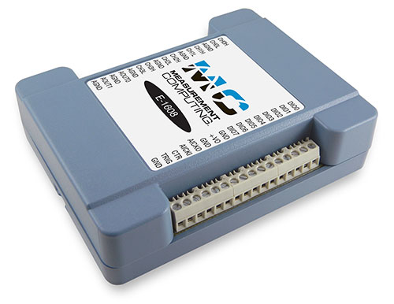

    **Photo of E-1608**

This module costs $525 and has the following features:

-  16-bit analog inputs

   -  8 single-ended channels or 4 differential channels
   -  Programmable per-channel range: +-1V, +-2V, +-5V, +-10V
   -  250 kHz total maximum input rate, i.e. 1 channel at 250 kHz, 2
      channels at 125 kHz, etc.
   -  Internal or external trigger.
   -  Internal or external clock for input signals.
   -  Input FIFO, unlimited waveform length

-  16-bit analog outputs

   -  2 channels, fixed +-10V range
   -  No output waveform capability

-  Digital inputs/outputs

   -  8 signals, individually programmable as inputs or outputs

-  Counter

   -  1 input
   -  10 MHz maximum rate, 32-bit register

More information can be found in the `E-1608 product
description. <https://www.mccdaq.com/ethernet-data-acquisition/E-1608-Series>`__

The following is the main medm screen for controlling the E-1608.

.. figure:: E1608_module.png
    :align: center

    **E1608_module.adl**

E-TC
~~~~

.. figure:: E-TC.jpg
    :align: center

    **Photo of E-TC**

This module costs $505 and has the following features:

-  Ethernet interface.
-  8 thermocouple inputs

   -  8 channels with cold-junction compensation. Types J, K, T, E, R,
      S, B, and N.
   -  4 samples/s.

-  Digital inputs/outputs

   -  8 signals, individually programmable as inputs or outputs

-  Counters

   -  1 input
   -  10 MHz maximum rate, 32-bit register

More information can be found in the `E-TC product
description. <https://www.mccdaq.com/ethernet-data-acquisition/thermocouple-input/24-bit-daq/E-TC.aspx>`__

The following is the main medm screen for controlling the E-TC.

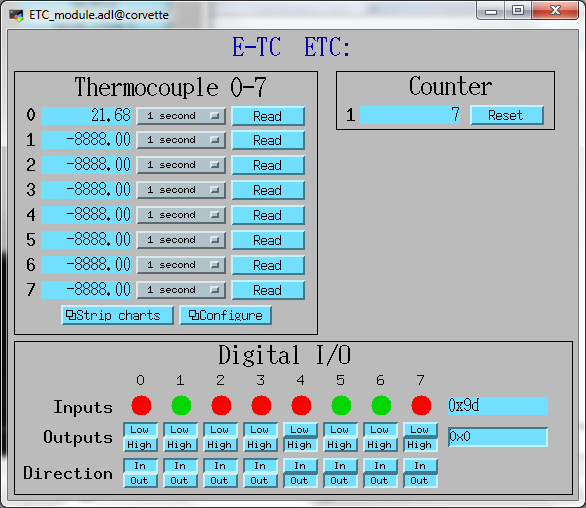

    **ETC_module.adl**

--------------

TC-32
~~~~~

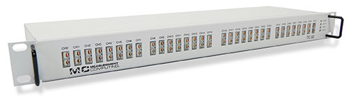

    **Photo of TC-32**

This module costs $1999 and has the following features:

-  USB and Ethernet interfaces, either can be used.
-  32 thermocouple inputs

   -  32 channels with cold-junction compensation. Types J, K, T, E, R,
      S, B, and N.
   -  3 samples/s if reading all 32 channels, faster if reading fewer.

-  Digital inputs

   -  8 digital inputs, switch-selectable pullup resistor

-  Digital outputs

   -  32 digital inputs, switch-selectable pullup resistor
   -  Each output can either be controlled by software or can be
      controlled by the alarm status of the corresponding thermocouple.
      Flexible alarm configuration, i.e. hysteresis.

More information can be found in the `TC-32 product
description. <http://www.mccdaq.com/usb-ethernet-data-acquisition/temperature/usb-ethernet-24-bit-thermocouple-daq/TC-32.aspx>`__

The following is the main medm screen for controlling the TC-32.

.. figure:: TC32_module.png
    :align: center

    **TC32_module.adl**

USB-1608G and USB-1608GX-2AO
~~~~~~~~~~~~~~~~~~~~~~~~~~~~

.. figure:: USB-1608GX-2AO.jpg
    :align: center

    **Photo of USB-1608GX-2AO**

This module costs $799 and has the following features:

-  16-bit analog inputs

   -  16 single-ended channels or 8 differential channels
   -  Programmable per-channel range: +-1V, +-2V, +-5V, +-10V
   -  500 kHz total maximum input rate, i.e. 1 channel at 500 kHz, 8
      channels at 62.5 kHz, etc.
   -  Internal or external trigger. External trigger shared with analog
      outputs.
   -  Internal or external clock, input and output signals.
   -  4 kSample input FIFO, unlimited waveform length

-  16-bit analog outputs

   -  2 channels, fixed +-10V range
   -  500 kHz total maximum output rate, i.e. 1 channel at 500 kHz, 2
      channels at 250 kHz
   -  Internal or external trigger. External trigger shared with analog
      inputs.
   -  Internal or external clock, input and output signals
   -  2 kSample output FIFO, unlimited waveform length

-  Digital inputs/outputs

   -  8 signals, individually programmable as inputs or outputs

-  Pulse generator

   -  1 output
   -  64MHz clock, 32-bit registers
   -  Programmable period, width, number of pulses, polarity

-  Counters

   -  2 inputs
   -  20 MHz maximum rate, 32-bit registers

More information can be found in the `USB-1608GX-2AO product
description. <http://www.mccdaq.com/usb-data-acquisition/USB-1608G-Series.aspx>`__

The USB-1608G is very similar to the USB-1608GX-2AO except that it does
not have any analog outputs and the analog inputs are limited to 250 kHz
rather than 500 kHz. More information can be found in the `USB-1608G
product
description. <http://www.mccdaq.com/usb-data-acquisition/USB-1608G-Series.aspx>`__

The following is the main medm screen for controlling the
USB-1608GX-2AO.

.. figure:: USB1608G_module.png
    :align: center

    **1608G_module.adl**

USB-1808 and USB-1808X
~~~~~~~~~~~~~~~~~~~~~~

.. figure:: USB-1808.jpg
    :align: center

    **Photo of USB-1808**

These modules cost $769 and $989 and have the following features:

-  18-bit analog inputs

   -  8 single-ended or differential channels
   -  Programmable per-channel range:+-5V, +-10V, 0-5V, 0-10V
   -  USB-1808: 125 kHz total maximum input rate, i.e. 1 channel at 125 kHz, 8
      channels at 15.625 kHz, etc.
   -  USB-1808X: 500 kHz total maximum input rate, i.e. 1 channel at 500 kHz, 8
      channels at 62.5 kHz, etc.
   -  Internal or external trigger. External trigger shared with analog
      outputs.
   -  Internal or external clock, input and output signals.
   -  4 kSample input FIFO, unlimited waveform length

-  16-bit analog outputs

   -  2 channels, fixed +-10V range
   -  USB-1808: 250 kHz total maximum output rate, i.e. 1 channel at 250 kHz, 2
      channels at 125 kHz
   -  USB-1808X: 1000 kHz total maximum output rate, i.e. 1 channel at 1000 kHz, 2
      channels at 500 kHz
   -  Internal or external trigger. External trigger shared with analog
      inputs.
   -  Internal or external clock, input and output signals
   -  2 kSample output FIFO, unlimited waveform length

-  Digital inputs/outputs

   -  4 signals, individually programmable as inputs or outputs

-  Pulse generator

   -  2 outputs
   -  100 MHz clock, 32-bit registers
   -  Programmable period, width, number of pulses, polarity

-  Counters

   -  2 inputs
   -  50 MHz maximum rate, 32-bit registers

-  Quadrature encoder inputs

   -  2 inputs
   -  50 MHz maximum rate, 32-bit registers

More information can be found in the `USB-1808 product
description. <https://www.mccdaq.com/PDFs/specs/DS-USB-1808-Series.pdf>`__

The following is the main medm screen for controlling the
USB-1808.

.. figure:: USB1808X_module.png
    :align: center

    **1808_module.adl**

USB-2408-2AO
~~~~~~~~~~~~

.. figure:: USB-2408-2AO.jpg
    :align: center

    **Photo of Photo of USB-2408-2AO**

This module costs $699 and has the following features:

-  24-bit analog inputs

   -  16 single-ended channels or 8 differential channels
   -  Programmable per-channel range: 8 ranges from +-0.078V to +-10V
   -  Thermocouple support for 8 channels with cold-junction
      compensation. Types J, K, T, E, R, S, B, or N.
   -  1 kHz total maximum input rate, i.e. 1 channel at 1 kHz, 8
      channels at 125 Hz, etc.
   -  Input FIFO, unlimited waveform length

-  16-bit analog outputs

   -  2 channels, fixed +-10V range
   -  1000 Hz total maximum output rate, i.e. 1 channel at 1000 Hz, 2
      channels at 500 Hz
   -  Output FIFO, unlimited waveform length

-  Digital inputs/outputs

   -  8 signals, individually programmable as inputs or outputs

-  Counters

   -  2 inputs
   -  1 MHz maximum rate, 32-bit registers

More information can be found in the `USB-2408-2AO product
description. <http://www.mccdaq.com/usb-data-acquisition/USB-2408-Series.aspx>`__

The following is the main medm screen for controlling the USB-2408-2AO.

.. figure:: USB2408_module.png
    :align: center

    **2408_module.adl**

USB-TEMP and USB-TEMP-AI
~~~~~~~~~~~~~~~~~~~~~~~~

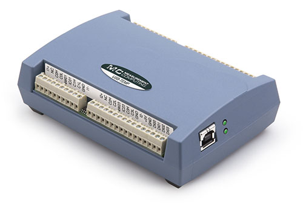

    **Photo of Photo of USB-TEMP**

The USB-TEMP costs $605 and the USB-TEMP-AI costs $795. They have the following features:

-  Temperature inputs

   -  8 temperature inputs on USB-TEMP, 4 on USB-TEMP-AI.
      These can be platinum resistance thermometers (RTD), thermocouples, thermistors,
      or semiconductor sensors.
   -  Thermocouple support has cold-junction compensation.
      Types J, K, T, E, R, S, B, or N.
   -  2 samples/s per channel.

-  24-bit analog inputs (USB-TEMP-AI only)

   -  4 channels
   -  Programmable per-channel range: 4 ranges from +-1.25V to +-10V

-  Digital inputs/outputs

   -  8 signals, individually programmable as inputs or outputs

-  Counters

   -  1 input
   -  1 MHz maximum rate, 32-bit register

More information can be found in the `USB-TEMP product
description. <https://www.mccdaq.com/usb-data-acquisition/USB-TEMP-Series.aspx>`__

The USB-TEMP and USB-TEMP-AI behave differently from all other Measurement Computing devices.  
On Windows InstaCal is used to select the temperature sensor type (RTD, thermocouple, etc.)
and the RTD wiring configuration.  
Those settings are written into non-volatile memory on the device, and cannot be changed with EPICS.
However, they **can** be changed with EPICS on Linux, so they are exposed in the OPI screen.

The following is the main medm screen for controlling the USB-TEMP-AI.

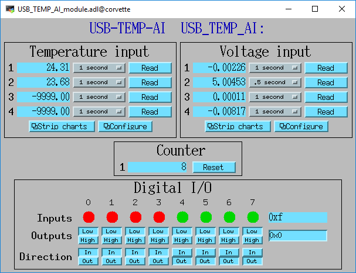

    **USBTEMP_AI_module.adl**

The following is the screen for configuring the temperature inputs.

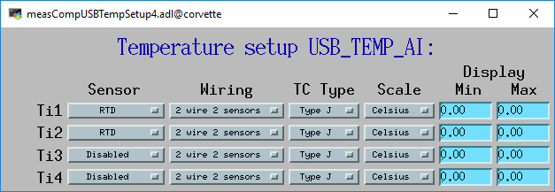

    **measCompUSBTempSetup4.adl**

USB-1208LS
~~~~~~~~~~

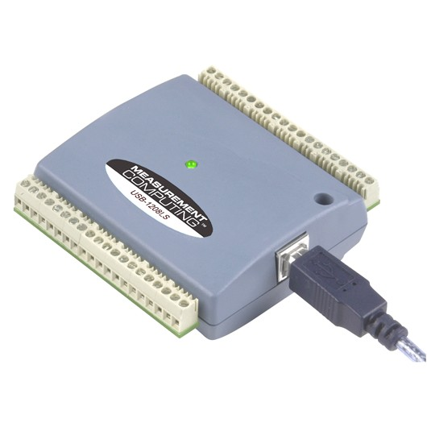

    **Photo of USB-1208LS**

This module costs $129 and has the following features:

-  12-bit analog inputs

   -  4 differential channels
   -  Programmable per-channel range: 8 ranges from +-1V to +-20V
   -  50 Hz maximum sampling rate. The module has a trigger input that
      allows higher sampling rates, but this is not yet supported in the
      EPICS driver.

-  10-bit analog outputs

   -  2 channels, fixed 0 to +5V range
   -  100 Hz maximum input rate

-  Digital inputs/outputs

   -  16 signals, programmable as inputs or outputs in groups of 8

-  Counters

   -  1 input
   -  1 MHz maximum rate, 32-bit register

More information can be found in the `USB-1208LS product
description. <http://www.mccdaq.com/usb-data-acquisition/USB-1208FS-LS-1408FS-Series.aspx>`__

The
`USB-1208HS <http://www.mccdaq.com/usb-data-acquisition/USB-1208FS-LS-1408FS-Series.aspx>`__
, `USB-1208FS-Plus <http://www.mccdaq.com/usb-data-acquisition/USB-1208FS-LS-1408FS-Series.aspx>`__
and
`USB-231 <http://www.mccdaq.com/usb-data-acquisition/USB-230-Series.aspx>`__
are similar devices but with higher performance.  These are also supported.

The following is the main medm screen for controlling the USB-1208LS.

.. figure:: USB1208LS_module.png
    :align: center

    **USB1208LS_module.adl**

E-DIO24
~~~~~~~

.. figure:: E-DIO24_500.jpg
    :align: center

    **Photo of E-DIO24**

This module costs $320 and has the following features:

-  Digital inputs/outputs

   -  24 signals, individually programmable as inputs or outputs

-  Counters

   -  1 input
   -  10 MHz maximum rate, 32-bit register

More information can be found in the `E-DIO24 product
description. <https://www.mccdaq.com/ethernet-data-acquisition/24-channel-digital-io-daq/E-DIO24-Series>`__

The following is the main medm screen for controlling the E-DIO24.

.. figure:: EDIO24_module.png
    :align: center

    **EDIO24_module.adl**

USB-3100
~~~~~~~~

.. figure:: USB-3100.jpg
    :align: center

    **Photo of USB-3101**

This series of module costs from $330 (USB-3101) to $660 (USB-3106) depending on the number of channels and the output type,
and has the following features:

-  16-bit analog outputs

   -  4, 8 or 16 channels, individually programmable range 0-10V or +-10V.
   -  Some models provide 0-20 mA current output as well as voltage output
   -  Some models have high-drive voltage output (+-40 mA)
   -  100 Hz maximum output rate

-  Digital inputs/outputs

   -  8 signals, individually programmable as inputs or outputs

-  Counters

   -  1 input
   -  1 MHz maximum rate, 32-bit register

More information can be found in the `USB-3100 series product
description. <https://www.mccdaq.com/usb-data-acquisition/USB-3100-Series.aspx>`__

The following is the main medm screen for controlling the USB-3104 8-channel unit.

.. figure:: USB3104_module.png
    :align: center

    **USB3104_module.adl**

The following is the medm screen for configuring the analog outputs on the USB-3104 8-channel unit.

.. figure:: USB3104_setup.png
    :align: center

    **USB3104_setup.adl**

Configuration
-------------

The following lines are needed in the EPICS startup script for the
multifunction driver.

::

   ## Configure port driver
   # MultiFunctionConfig(portName,        # The name to give to this asyn port driver
   #                     uniqueID,        # For USB the serial number.  For Ethernet the MAC address or IP address.
   #                     maxInputPoints,  # Maximum number of input points for waveform digitizer
   #                     maxOutputPoints) # Maximum number of output points for waveform generator
   MultiFunctionConfig("1608G_1", 1, 1048576, 1048576)
   dbLoadTemplate("1608G.substitutions.big")

The uniqueID is a string that identifies the device to be controlled.

- For USB devices the uniqueID is the serial number, which is printed on the device (e.g. "01F6335A").
- For Ethernet devices the uniqueID can either be the MAC address (e.g. "00:80:2F:24:53:DE"),
  or the IP address (e.g. "10.54.160.63", or the IP DNS name (e.g. "gse-e1601-1").
  The MAC address, IP address or IP name can be used for devices on the local subnet,
  while the IP address or IP name must be used for devices on other subnets.

The measComp module comes with example iocBoot/ directories that contain
example startup scripts and example substitutions files for each supported model.

Databases
---------

The following tables list the database template files that are used with
the multi-function modules.

Overall Device Functions
~~~~~~~~~~~~~~~~~~~~~~~~

These are the records defined in measCompDevice.template.
This database is loaded once for each module.

.. cssclass:: table-bordered table-striped table-hover
.. list-table::
  :header-rows: 1
  :widths: 10 10 10 10 60

  * - EPICS record name
    - EPICS record type
    - asyn interface
    - drvInfo string
    - Description
  * - $(P)ModelName
    - stringin
    - asynOctetRead
    - MODEL_NAME
    - The model name of this device, e.g. "USB-1808X".
  * - $(P)ModelNumber
    - longin
    - asynInt32
    - MODEL_NUMBER
    - The model number of this device, e.g. 318.
  * - $(P)FirmwareVersion
    - stringin
    - asynOctetRead
    - FIRMWARE_VERSION
    - The firmware version, e.g. "1.03".
  * - $(P)UniqueID
    - stringin
    - asynOctetRead
    - UNIQUE_ID
    - The unique ID of this device, e.g. "02151405"
  * - $(P)ULVersion
    - stringin
    - asynOctetRead
    - UL_VERSION
    - The version of the UL library on Linux or Windows, e.g. "1.2.0".
  * - $(P)DriverVersion
    - stringin
    - asynOctetRead
    - DRIVER_VERSION
    - The version of the EPICS driver, e.g. "4.3".
  * - $(P)PollTimeMS
    - ai
    - asynFloat64
    - POLL_TIME_MS
    - The actual time for the last poll cycle in ms.
  * - $(P)PollSleepMS
    - ao
    - asynFloat64
    - POLL_SLEEP_MS
    - The time to sleep at the end of each poll cycle in ms.
  * - $(P)LastErrorMessage
    - waveform
    - asynOctetRead
    - LAST_ERROR_MESSAGE
    - The last error message from the driver.

The medm sub-screen that displays these records.
The main screen for every module contains a subscreen like this.

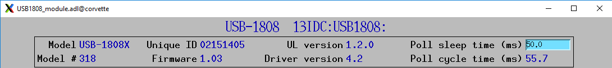

    **measCompDevice.adl**

Analog I/O Functions
~~~~~~~~~~~~~~~~~~~~

These are the records defined in measCompAnalogIn.template.
This database is loaded once for each analog input channel

.. cssclass:: table-bordered table-striped table-hover
.. list-table::
  :header-rows: 1
  :widths: 10 10 10 10 60

  * - EPICS record name
    - EPICS record type
    - asyn interface
    - drvInfo string
    - Description
  * - $(P)$(R)
    - ai
    - asynInt32
    - ANALOG_IN_VALUE
    - Analog input value. This is converted from the 16-bit unsigned integer device units
      from the driver to engineering units using the EGUL and EGUF fields. 
      This value is polled in the driver at the polling frequency set by PollSleepMS.
      The asynInt32Average device support is used, so that the ai value
      is the average of all the readings from the poller since the last time the record processed.  
      For example, if the poller is running at 100 Hz and the ai record SCAN field is "0.2 seconds"
      then 20 values will be averaged each time the record processes.
      If SCAN=I/O Intr then the device support will average the number of values specified in the SVAL
      field of the record.  
      If SVAL<=1 then the record will processes on each callback, so there is no averaging.
  * - $(P)$(R)Range
    - mbbo
    - asynInt32
    - ANALOG_IN_RANGE
    - Input range for this analog input channel. Choices are determined at run time based
      on the model in use.
  * - $(P)$(R)Type
    - mbbo
    - asynInt32
    - ANALOG_IN_TYPE
    - Input type (e.g. "Volts", "TC deg", etc.) for this analog input channel. Choices
      are determined at run time based on the model in use.

The following is the medm screen for controlling the analog input
records for the USB-1608GX-2AO. Note that the engineering units limits
(EGUL and EGUF) do not have to be in volts, they can be in any units
such as "percent", "degrees", etc.

.. figure:: measCompAiSetup.png
    :align: center

    **measCompAiSetup.adl**

These are the records defined in measCompAnalogOut.template.
This database is loaded once for each analog output channel

.. cssclass:: table-bordered table-striped table-hover
.. list-table::
  :header-rows: 1
  :widths: 10 10 10 10 60

  * - EPICS record name
    - EPICS record type
    - asyn interface
    - drvInfo string
    - Description
  * - $(P)$(R)
    - ai
    - asynInt32
    - ANALOG_OUT_VALUE
    - Analog output value. This is converted from engineering units to the 16-bit unsigned
      integer device units for the driver using the EGUL and EGUF fields.
  * - $(P)$(R)Range
    - mbbo
    - asynInt32
    - ANALOG_OUT_RANGE
    - Output range for this analog output channel. Choices are determined at run time
      based on the model in use.
  * - $(P)$(R)Return
    - ai
    - asynInt32
    - ANALOG_OUT_VALUE
    - Analog output value to return to at the end of a pulse. This is converted from engineering
      units to the 16-bit unsigned integer device units for the driver using the EGUL
      and EGUF fields.
  * - $(P)$(R)Pulse
    - bo
    - N.A.
    - N.A.
    - Choices are "Normal" and "Pulse". In Normal mode the Return record is ignored. In
      Pulse mode the $(P)($R) output is written to to hardware, followed immediately by
      writing the $(P)$(R)Return value.
  * - $(P)$(R)TweakVal
    - ao
    - N.A.
    - N.A.
    - The amount by which to tweak the out when the Tweak record is processed.
  * - $(P)$(R)TweakUp
    - calcout
    - N.A.
    - N.A.
    - Tweaks the output up by TweakVal.
  * - $(P)$(R)TweakDown
    - calcout
    - N.A.
    - N.A.
    - Tweaks the output down by TweakVal.

The following is the medm screen for controlling the analog output
records for the USB-1608GX-2AO. Note that the engineering units limits
(EGUL and EGUF) do not have to be in volts, they can be in any units
such as "percent", "degrees", etc. The drive limits can be more
restrictive than the full +-10V output range of the analog outputs.

.. figure:: measCompAoSetup.png
    :align: center

    **measCompAoSetup.adl**

Temperature Functions
~~~~~~~~~~~~~~~~~~~~~

These are the records defined in measCompTemperatureIn.template.
This database is loaded once for each temperature input channel.

.. cssclass:: table-bordered table-striped table-hover
.. list-table::
  :header-rows: 1
  :widths: 10 10 10 10 60

  * - EPICS record name
    - EPICS record type
    - asyn interface
    - drvInfo string
    - Description
  * - $(P)$(R)
    - ai
    - asynFloat64
    - TEMPERATURE_IN_VALUE
    - Temperature input value. This field should be periodically scanned, since it is
      not currently polled in the driver, so I/O Intr scanning cannot be used.
  * - $(P)$(R)Scale
    - mbbo
    - asynInt32
    - TEMPERATURE_SCALE
    - Temperature scale (units) for this temperature input channel. Choices are "Celsius"
      (0), "Fahrenheit" (1), "Kelvin" (2), "Volts" (4), and "Noscale" (5).
  * - $(P)$(R)TCType
    - mbbo
    - asynInt32
    - THERMOCOUPLE_TYPE
    - Thermocouple type. Choices are "Type J" (1), "Type K" (2), "Type T" (3), "Type 4"
      (4), "Type R" (5), "Type S" (6), "Type B" (7), "Type N" (8)
  * - $(P)$(R)Filter
    - mbbo
    - asynInt32
    - TEMPERATURE_FILTER
    - Temperature filter. Choices are "Filter" (0) and "No filter" (0x400)

The following is the main medm screen for configuring the
analog/temperature inputs on the USB-2408-2AO.

.. figure:: measCompTemperatureSetup.png
    :align: center

    **measCompTemperatureSetup.adl**

Digital I/O Functions
~~~~~~~~~~~~~~~~~~~~~

These are the records defined in the following files:

- measCompBinaryIn.template. This database is loaded once for each binary I/O bit.
- measCompLongIn.template. This database is loaded once for each binary I/O register.
- measCompBinaryOut.template. This database is loaded once for each binary I/O bit.
- measCompLongOut.template. This database is loaded once for each binary I/O register.
- measCompBinaryDir.template. This database is loaded once for each binary I/O bit.

.. cssclass:: table-bordered table-striped table-hover
.. list-table::
  :header-rows: 1
  :widths: 10 10 10 10 60

  * - EPICS record name
    - EPICS record type
    - asyn interface
    - drvInfo string
    - Description
  * - $(P)$(R)
    - bi
    - asynUInt32Digital
    - DIGITAL_INPUT
    - Digital input value. The MASK parameter in the INP link defines which bit is used.
      The binary inputs are polled by the driver poller thread, so these records should
      have SCAN="I/O Intr".
  * - $(P)$(R)
    - longin
    - asynUInt32Digital
    - DIGITAL_INPUT
    - Digital input value as a word, rather than individual bits. The MASK parameter in
      the INP link defines which bits are used. The binary inputs are polled by the driver
      poller thread, so this record should have SCAN="I/O Intr".
  * - $(P)$(R)
    - bo
    - asynUInt32Digital
    - DIGITAL_OUTPUT
    - Digital output value. The MASK parameter in the INP link defines which bit is used.
  * - $(P)$(R)_RBV
    - bi
    - asynUInt32Digital
    - DIGITAL_OUTPUT
    - Digital output value readback. The MASK parameter in the INP link defines which
      bit is used.
  * - $(P)$(R)
    - longout
    - asynUInt32Digital
    - DIGITAL_OUTPUT
    - Digital output value as a word, rather than individual bits. The MASK parameter
      in the INP link defines which bits are used.
  * - $(P)$(R)_RBV
    - longin
    - asynUInt32Digital
    - DIGITAL_OUTPUT
    - Digital output value readback as a word, rather than individual bits. The MASK parameter
      in the INP link defines which bits are used.
  * - $(P)$(R)
    - bo
    - asynUInt32Digital
    - DIGITAL_DIRECTION
    - Direction of this I/O line, "In" (0) or "Out" (1). The MASK parameter in the INP
      link defines which bit is used.

Pulse Generator Functions 
~~~~~~~~~~~~~~~~~~~~~~~~~

**Note:** These are called "timers" in Measurement Computing's documentation.

These are the records defined in measCompPulseGen.template.
This database is loaded once for each pulse generator.

.. cssclass:: table-bordered table-striped table-hover
.. list-table::
  :header-rows: 1
  :widths: 10 10 10 10 60

  * - EPICS record name
    - EPICS record type
    - asyn interface
    - drvInfo string
    - Description
  * - $(P)$(R)Run
    - bo
    - asynUInt32
    - PULSE_RUN
    - "Run" (1) starts the pulse generator, "Stop" (0) stops the pulse generator. Note
      that ideally this record should go back to 0 when the pulse generator is done, if
      it is outputting a finite number of pulses (see Count record). But unfortunately
      the Measurement Computing library does not have a way to query the status of the
      timer to see if it is done, so this is not possible.
  * - $(P)$(R)Period
    - ao
    - asynFloat64
    - PULSE_PERIOD
    - Pulse period, in seconds. The time between pulses can be defined either with the
      Period or with the Frequency; whenever one record is changed the other is updated
      with the new calculated value.
  * - $(P)$(R)Frequency
    - ao
    - N.A.
    - N.A.
    - Pulse frequency, in seconds. The Frequency calculates a new value of the Period,
      and sends the period value to the driver.
  * - $(P)$(R)Width
    - ao
    - asynFloat64
    - PULSE_WIDTH
    - Pulse width, in seconds. The allowed range is 15.625 ns to (Period-15.625 ns).
  * - $(P)$(R)Delay
    - ao
    - asynFloat64
    - PULSE_DELAY
    - Initial pulse delay in seconds after Run is set to 1.
  * - $(P)$(R)Count
    - longout
    - asynInt32
    - PULSE_COUNT
    - Number of pulses to output. If the Count is 0 then the pulse generator runs continuously
      until Run is set to 0.
  * - $(P)$(R)IdleState
    - bo
    - asynInt32
    - PULSE_IDLE_STATE
    - The idle state of the pulse output line, "Low" (0) or "High" (1). This determines
      the polarity of the pulse, i.e. positive going or negative going.

Waveform Digitizer Functions
~~~~~~~~~~~~~~~~~~~~~~~~~~~~

These records are defined in the following files:

- measCompWaveformDig.template. This database is loaded once per module.
- measCompWaveformDigN.template. This database is loaded for each digitizer input channel.

.. cssclass:: table-bordered table-striped table-hover
.. list-table::
  :header-rows: 1
  :widths: 10 10 10 10 60

  * - EPICS record name
    - EPICS record type
    - asyn interface
    - drvInfo string
    - Description
  * - $(P)$(R)NumPoints
    - longout
    - asynInt32
    - WAVEDIG_NUM_POINTS
    - Number of points to digitize. This cannot be more than the value of maxInputPoints
      that was specified in USB1608GConfig.
  * - $(P)$(R)FirstChan
    - mbbo
    - asynInt32
    - WAVEDIG_FIRST_CHAN
    - First channel to digitize. "1" (0) to "8" (7). The database currently assumes differential
      inputs, so only 8 inputs are available, though this can easily be extended to 16.
  * - $(P)$(R)NumChans
    - mbbo
    - asynInt32
    - WAVEDIG_NUM_CHANS
    - Number of channels to digitize. "1" (0) to "8" (7). The maximum valid number is
      8-FirstChan+1. The database currently assumes differential inputs, so only 8 inputs
      are available, though this can easily be extended to 16.
  * - $(P)$(R)TimeWF
    - waveform
    - asynFloat32Array
    - WAVEDIG_TIME_WF
    - Timebase waveform. These values are calculated when Dwell or NumPoints are changed.
      It is typically used as the X-axis in plots.
  * - $(P)$(R)CurrentPoint
    - longin
    - asynInt32
    - WAVEDIG_CURRENT_POINT
    - The current point being collected. This does not always increment by 1 because the
      device can transfer data in blocks.
  * - $(P)$(R)Dwell
    - ao
    - asynFloat64
    - WAVEDIG_DWELL
    - The time per point in seconds. The minimum time is 2 microseconds times NumChans.
  * - $(P)$(R)TotalTime
    - ai
    - asynFloat64
    - WAVEDIG_TOTAL_TIME
    - The total time to digitize NumChans*NumPoints.
  * - $(P)$(R)ExtTrigger
    - bo
    - asynInt32
    - WAVEDIG_EXT_TRIGGER
    - The trigger source, "Internal" (0) or "External" (1).
  * - $(P)$(R)ExtClock
    - bo
    - asynInt32
    - WAVEDIG_EXT_CLOCK
    - The clock source, "Internal" (0) or "External" (1). If External is used then the
      Dwell record does not control the digitization rate, it is controlled by the external
      clock. However Dwell should be set to approximately the correct value if possible,
      because that controls what type of data transfers the device uses.
  * - $(P)$(R)Continuous
    - bo
    - asynInt32
    - WAVEDIG_CONTINUOUS
    - Values are "One-shot" (0) or "Continuous" (1). This controls whether the device
      stops when acquisition is complete, or immediately begins another acquisition. Typically
      "One-shot" is used, because the driver is currently not double-buffered, so data
      could be overwritten before the driver has a chance to read the data. One exception
      is when using Retrigger=Enable and TriggerCount less than NumPoints. In that case
      each trigger will only collect TriggerCount samples, and one wants to use Continuous
      so that it collects the next TriggerCount samples on the next trigger input.
  * - $(P)$(R)AutoRestart
    - bo
    - asynInt32
    - WAVEDIG_AUTO_RESTART
    - Values are "Disable" (0) and "Enable" (1). This controls whether the driver automatically
      starts another acquire when the previous one completes. This is different from Continuous
      mode described above, because this is a software restart that only happens after
      the driver has read the buffer from the previous acquisition.
  * - $(P)$(R)Retrigger
    - bo
    - asynInt32
    - WAVEDIG_RETRIGGER
    - Values are "Disable" (0) and "Enable" (1). This controls whether the device rearms
      the trigger input after a trigger is received.
  * - $(P)$(R)TriggerCount
    - longout
    - asynInt32
    - WAVEDIG_TRIGGER_COUNT
    - This controls how many samples are collected on each trigger input. 0 means collect
      NumPoint samples. If TriggerCount is less than NumPoints, Retrigger=Enable and Continuous=Enable
      then each time a trigger is received TriggerCount samples will be collected.
  * - $(P)$(R)BurstMode
    - bo
    - asynInt32
    - WAVEDIG_BURST_MODE
    - Values are "Disable" (0) and "Enable" (1). This controls whether the device digitizes
      all NumChans channels as quickly as possible during each sample, or whether it digitizes
      successive channels at evenly spaced time intevals during the Dwell time. Enabling
      BurstMode means that all channels are digitized 2 microseconds apart. This can reduce
      the accuracy if the channels have very different voltages because of the settling
      time and slew rate limitations of the system.
  * - $(P)$(R)Run
    - busy
    - asynInt32
    - WAVEDIG_RUN
    - Values are "Stop" (0) and "Run" (1). This starts and stops the waveform digitizer.
  * - $(P)$(R)ReadWF
    - busy
    - asynInt32
    - WAVEDIG_READ_WF
    - Values are "Done" (0) and "Read" (1). This reads the waveform data from the device
      buffers into the waveform records. Note that the driver always reads device when
      acquisition stops, so for quick acquisitions this record can be Passive. To see
      partial data during long acquisitions this record can be periodically processed.
  * - $(P)$(R)VoltWF
    - waveform
    - asynFloat64Array
    - WAVEDIG_VOLT_WF
    - This waveform record contains the digitizer waveform data for channel N. This record
      has scan=I/O Intr, and it will process whenever acquisition completes, or whenever
      the ReadWF record above processes. The data are in volts.

This is a plot of a digitized waveform captured of someone speaking into a microphone.

.. figure:: measCompWaveDigPlot.png
    :align: center

    **Waveform digitizer plot**

Waveform Generator Functions
~~~~~~~~~~~~~~~~~~~~~~~~~~~~

These records are defined in the following files:

- measCompWaveformGen.template. This database is loaded once per module.
- measCompWaveformGenN.template. This database is loaded for each waveform generator output channel.

.. cssclass:: table-bordered table-striped table-hover
.. list-table::
  :header-rows: 1
  :widths: 10 10 10 10 60

  * - EPICS record name
    - EPICS record type
    - asyn interface
    - drvInfo string
    - Description
  * - $(P)$(R)NumPoints
    - longin
    - asynInt32
    - WAVEGEN_NUM_POINTS
    - Number of points output waveform. The value of this record is equal to UserNumPoints
      if user-defined waveforms are selected, or IntNumPoints if internal predefined waveforms
      are selected.
  * - $(P)$(R)UserNumPoints
    - longout
    - asynInt32
    - WAVEGEN_USER_NUM_POINTS
    - Number of points in user-defined output waveforms. This cannot be more than the
      value of maxOutputPoints that was specified in USB1608GConfig.
  * - $(P)$(R)IntNumPoints
    - longout
    - asynInt32
    - WAVEGEN_INT_NUM_POINTS
    - Number of points in internal predefined output waveforms. This cannot be more than
      the value of maxOutputPoints that was specified in USB1608GConfig.
  * - $(P)$(R)UserTimeWF
    - waveform
    - asynFloat32Array
    - WAVEDIG_USER_TIME_WF
    - Timebase waveform for user-defined waveforms. These values are calculated when UserDwell
      or UserNumPoints are changed. It is typically used as the X-axis in plots.
  * - $(P)$(R)IntTimeWF
    - waveform
    - asynFloat32Array
    - WAVEGEN_INT_TIME_WF
    - Timebase waveform for internal predefined waveforms. These values are calculated
      when IntDwell or IntNumPoints are changed. It is typically used as the X-axis in
      plots.
  * - $(P)$(R)CurrentPoint
    - longin
    - asynInt32
    - WAVEGEN_CURRENT_POINT
    - The current point being output. This does not always increment by 1 because the
      device can transfer data in blocks.
  * - $(P)$(R)Frequency
    - ai
    - asynFloat64
    - WAVEGEN_FREQUENCY
    - The output frequency (waveforms/second). The value of this record is equal to UserFrequency
      if user-defined waveforms are selected, or IntFrequency if internal predefined waveforms
      are selected.
  * - $(P)$(R)Dwell
    - ai
    - asynFloat64
    - WAVEGEN_DWELL
    - The output dwell time or period (seconds/sample). The value of this record is equal
      to UserDwell if user-defined waveforms are selected, or IntDwell if internal predefined
      waveforms are selected.
  * - $(P)$(R)UserDwell
    - ao
    - asynFloat64
    - WAVEGEN_USER_DWELL
    - The output dwell time or period (seconds/sample) for user-defined waveforms. This
      record is automatically changed if UserFrequency is modified.
  * - $(P)$(R)IntDwell
    - ao
    - asynFloat64
    - WAVEGEN_INT_DWELL
    - The output dwell time or period (seconds/sample) for internal predefined waveforms.
      This record is automatically changed if IntFrequency is modified.
  * - $(P)$(R)UserFrequency
    - ao
    - N.A.
    - N.A.
    - The output frequency (waveforms/second) for user-defined waveforms. This record
      computes UserDwell and writes to that record. This record is automatically changed
      if UserDwell is modified.
  * - $(P)$(R)IntFrequency
    - ao
    - N.A.
    - N.A.
    - The output frequency (waveforms/second) for internal predefined waveforms. This
      record computes IntDwell and writes to that record. This record is automatically
      changed if IntDwell is modified.
  * - $(P)$(R)TotalTime
    - ai
    - asynFloat64
    - WAVEGEN_TOTAL_TIME
    - The total time to output the waveforms. This is Dwell*NumPoints.
  * - $(P)$(R)ExtTrigger
    - bo
    - asynInt32
    - WAVEGEN_EXT_TRIGGER
    - The trigger source, "Internal" (0) or "External" (1).
  * - $(P)$(R)ExtClock
    - bo
    - asynInt32
    - WAVEGEN_EXT_CLOCK
    - The clock source, "Internal" (0) or "External" (1). If External is used then the
      Dwell record does not control the output rate, it is controlled by the external
      clock. However Dwell should be set to approximately the correct value if possible,
      because that controls what type of data transfers the device uses.
  * - $(P)$(R)Continuous
    - bo
    - asynInt32
    - WAVEGEN_CONTINUOUS
    - Values are "One-shot" (0) or "Continuous" (1). This controls whether the device
      stops when the output waveform is complete, or immediately begins again at the start
      of the waveform.
  * - $(P)$(R)Retrigger
    - bo
    - asynInt32
    - WAVEGEN_RETRIGGER
    - Values are "Disable" (0) and "Enable" (1). This controls whether the device rearms
      the trigger input after a trigger is received.
  * - $(P)$(R)TriggerCount
    - longout
    - asynInt32
    - WAVEGEN_TRIGGER_COUNT
    - This controls how many values are output on each trigger input. 0 means output NumPoints
      samples. If TriggerCount is less than NumPoints, Retrigger=Enable and Continuous=Enable
      then each time a trigger is received TriggerCount samples will be output.
  * - $(P)$(R)Run
    - busy
    - asynInt32
    - WAVEGEN_RUN
    - Values are "Stop" (0) and "Run" (1). This starts and stops the waveform generator.
  * - $(P)$(R)UserWF
    - waveform
    - asynFloat32Array
    - WAVEGEN_USER_WF
    - This waveform record contains the user-defined waveform generator data for channel
      N. The data are in volts. These data are typically generated by an EPICS Channel
      Access client.
  * - $(P)$(R)InternalWF
    - waveform
    - asynFloat32Array
    - WAVEGEN_INT_WF
    - This waveform record contains the internal predefined waveform generator data for
      channel N. The data are in volts.
  * - $(P)$(R)Enable
    - bo
    - asynInt32
    - WAVEGEN_ENABLE
    - Values are "Disable" and "Enable". Controls whether channel N output is enabled.
  * - $(P)$(R)Type
    - mbbo
    - asynInt32
    - WAVEGEN_WAVE_TYPE
    - Controls the waveform type on channel N. Values are "User-defined" and "Sin wave",
      "Square wave", "Sawtooth", "Pulse", or "Random". Note that if any channel is "User-defined"
      then all channels must be. Note that all internally predefined waveforms are symmetric
      about 0 volts. To output unipolar signals the Offset should be set to +-Amplitude/2.
  * - $(P)$(R)PulseWidth
    - ao
    - asynFloat64
    - WAVEGEN_PULSE_WIDTH
    - Controls the pulse width in seconds if Type is "Pulse".
  * - $(P)$(R)Amplitude
    - ao
    - asynFloat64
    - WAVEGEN_AMPLITUDE
    - Controls the amplitude of the waveform. For internally predefined waveforms this
      directly controls the peak-to-peak amplitude in volts. For user-defined waveforms
      this is a scale factor that multiplies the values in the waveform, i.e. 1.0 outputs
      the user-defined waveform unchanged, 2.0 increases the amplitide by 2, etc. For
      both internal and used-defined waveforms changing the sign of the Amplitude controls
      the polarity of the signal.
  * - $(P)$(R)Offset
    - ao
    - asynFloat64
    - WAVEGEN_OFFSET
    - Controls the offset of the waveform in volts. For user-defined waveforms, this value
      is added to the waveform, i.e. 0.0 outputs the user-defined waveform unchanged,
      1.0 adds 1 volt, etc.

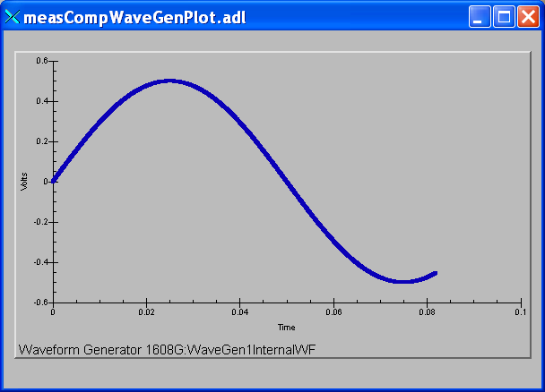

    **Plot of an internal predefined waveform (sin wave)**

.. figure:: measCompWaveGenPlot_user.png
    :align: center

    **Plot of a user-defined waveform (sum of sin and cos waves)**

Trigger Functions
~~~~~~~~~~~~~~~~~

These records are defined in measCompTrigger.template. This database is loaded once per module.

.. cssclass:: table-bordered table-striped table-hover
.. list-table::
  :header-rows: 1
  :widths: 10 10 10 10 60

  * - EPICS record name
    - EPICS record type
    - asyn interface
    - drvInfo string
    - Description
  * - $(P)$(R)Mode
    - mbbo
    - asynInt32
    - TRIGGER_MODE
    - The mode of the external trigger input. Choices are "Positive edge", "Negative edge",
      "High", and "Low".

Box for USB-CTR08, USB-3104, and USB-1808X
------------------------------------------

The following photo is a box we built to house the USB-CTR08, USB-3104, and USB-1808X
and provide BNC I/O connections.

.. figure:: 3ModuleBox.jpg
    :align: center

    **GSECARS designed box for USB-CTR08, USB-3104, and USB-1808X**

Box for USB-2408-2AO
--------------------

The following photos show a box we built to house the USB-2408-2AO and
provide I/O connections.

This is the top view.

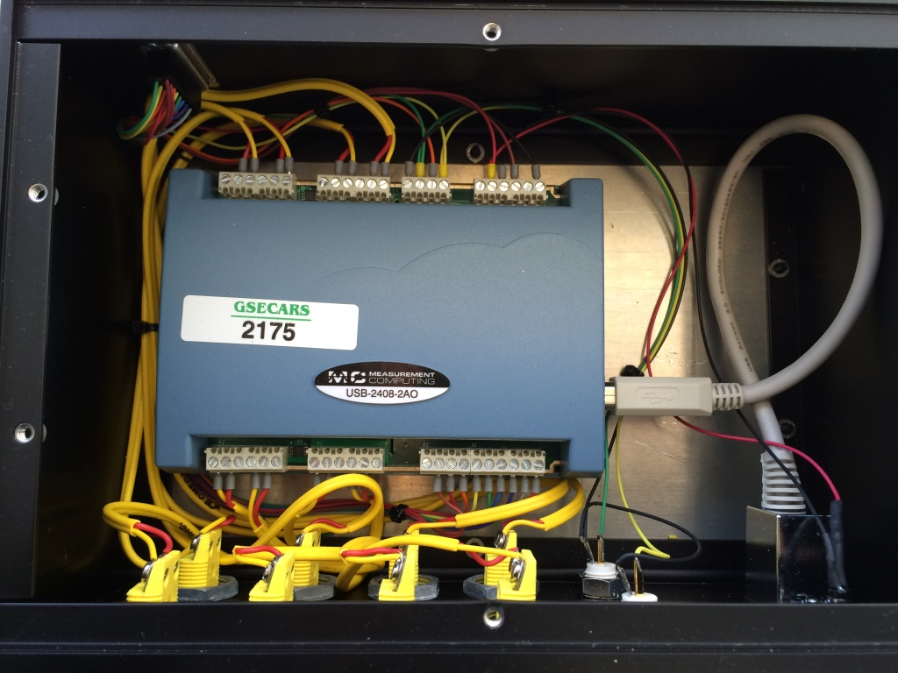

    **Top view of USB-2408-2AO box**

These are the side views.

.. figure:: USB2408_Box_Sides.jpg
    :align: center

    **Side views of USB-2408-2AO box**

.. _Performance_MF:

Performance measurements
------------------------

The following summarizes a simple test of the precision and accuracy of
the analog outputs and analog inputs of the USB-1608GX-2AO. The test
configuration was with Analog Output 0 connected to Analog Input 0, and
also to a Keithley 2700 digital multimeter. The Keithley is a 6.5 digit
(22 bit) device, so it can be used to measure the accuracy of the
USB-1608GX-2AO analog output, and provide the "true" value to measure
the accuracy of the analog input. The 1608GX analog inputs records and
the Keithley input had SCAN=0.1 second, so new readings were being made
at 10Hz. The following IDL test program was used to drive the analog
output from -10V to +10V in 0.1V steps. 10 readings were made of the
1608GX analog inputs, and one reading of the Keithley at each voltage
step. These tests were done with the +-10V range of the analog outputs
and analog inputs. Since these are 16-bit devices, one bit is 20V/65536
= 0.000305 volts.

::

   pro test_analog_performance_1608,  ao=ao, ai=ai, min_volts=min_volts, max_volts=max_volts, $
                                      step_volts=step_volts, num_samples=num_samples, delay=delay, $
                                      keithley=keithley, results
                                      
     if (n_elements(ao)          eq 0) then ao          = '1608G:Ao1'
     if (n_elements(ai)          eq 0) then ai          = '1608G:Ai1'
     if (n_elements(min_volts)   eq 0) then min_volts   = -10.0
     if (n_elements(max_volts)   eq 0) then max_volts   =  10.0
     if (n_elements(step_volts)  eq 0) then step_volts  = 0.1
     if (n_elements(num_samples) eq 0) then num_samples = 10 
     if (n_elements(delay)       eq 0) then delay       = 0.1
     if (n_elements(keithley)    eq 0) then keithley    = '13LAB:DMM2Dmm_raw.VAL'

     output = min_volts
     samples = dblarr(num_samples)
     num_points = ((max_volts - min_volts) / step_volts + 0.5) + 1
     results = dblarr(4, num_points)
     for i=0, num_points-1 do begin
       output = min_volts + i*step_volts
       t = caput(ao, output)
       wait, 2*delay
       for j=0, num_samples-1 do begin
         wait, delay
         t = caget(ai, temp)
         samples[j] = temp
       endfor
       m = moment(samples)
       results[0,i] = output
       results[1,i] = m[0]
       results[2,i] = sqrt(m[1])
       t = caget(keithley, temp)
       results[3,i] = temp
       print, results[0,i], results[1,i], results[2,i], results[3,i]
     endfor
   end

The following plot shows the difference of the nominal USB-1608GX-2AO analog
output voltage from the Keithley 2700 reading. The mean error is
0.000312V, or just over 1 bit. The RMS error is 0.000203V, or less than
1 bit.

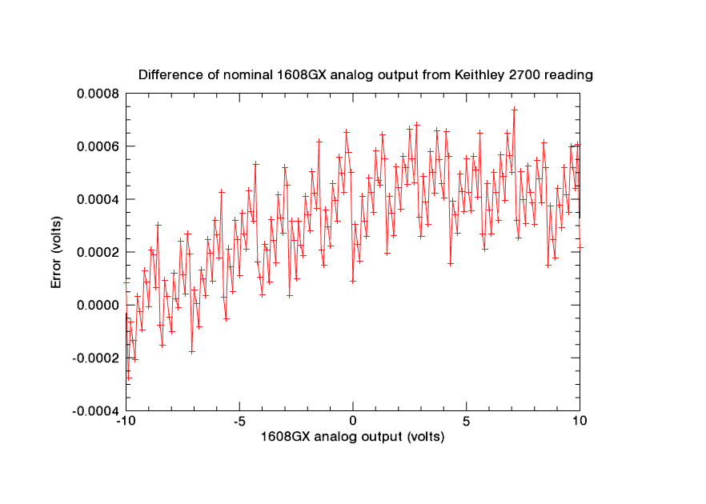

    **USB-1608GX-2AO analog output voltage error**

The following plot shows the difference of the mean of 10 readings of
the 1608GX analog input voltage from the Keithley 2700 reading. The mean
error is 0.000106V, less than 1 bit. The RMS error is 0.000259V, also
less than 1 bit.

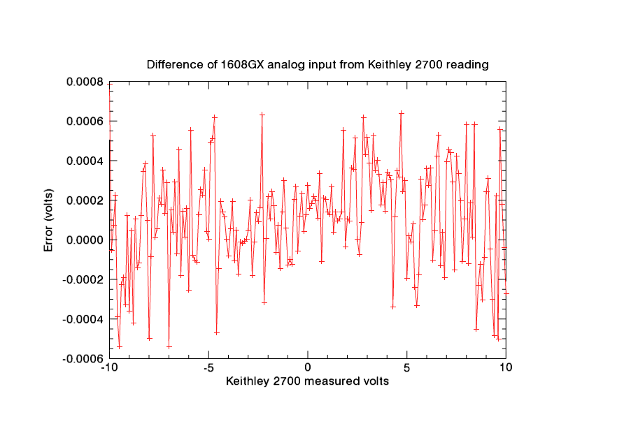

    **USB-1608GX-2AO analog input voltage error**

The following plot shows the standard deviation of 10 readings of the
1608GX analog input voltage. The values range from about 0.001V (~3
bits) at +-10V to less than 0.0003V (1 bit) between -2 and +2V.

.. figure:: measCompAiStdDev.png
    :align: center

    **USB-1608GX-2AO analog input standard deviation**

The following table contains all of the results from the tests.

+----------------+----------------+----------------+----------------+
| 1608GX analog  | 1608GX analog  | Std. Dev. of   | Keithley 2700  |
| output         | input (mean of | 10 1608GX      | reading        |
| (nominal)      | 10 readings)   | analog input   |                |
|                |                | readings       |                |
+================+================+================+================+
| -10.00000      | -9.99930       | 0.00084        | -10.00008      |
+----------------+----------------+----------------+----------------+
| -9.90000       | -9.89978       | 0.00130        | -9.89972       |
+----------------+----------------+----------------+----------------+
| -9.80000       | -9.79986       | 0.00126        | -9.79994       |
+----------------+----------------+----------------+----------------+
| -9.70000       | -9.69964       | 0.00134        | -9.69987       |
+----------------+----------------+----------------+----------------+
| -9.60000       | -9.60018       | 0.00123        | -9.59979       |
+----------------+----------------+----------------+----------------+
| -9.50000       | -9.50057       | 0.00099        | -9.50003       |
+----------------+----------------+----------------+----------------+
| -9.40000       | -9.40020       | 0.00117        | -9.39997       |
+----------------+----------------+----------------+----------------+
| -9.30000       | -9.30010       | 0.00080        | -9.29991       |
+----------------+----------------+----------------+----------------+
| -9.20000       | -9.20046       | 0.00105        | -9.20013       |
+----------------+----------------+----------------+----------------+
| -9.10000       | -9.09996       | 0.00118        | -9.10009       |
+----------------+----------------+----------------+----------------+
| -9.00000       | -9.00035       | 0.00122        | -8.99999       |
+----------------+----------------+----------------+----------------+
| -8.90000       | -8.90016       | 0.00079        | -8.90021       |
+----------------+----------------+----------------+----------------+
| -8.80000       | -8.80061       | 0.00118        | -8.80019       |
+----------------+----------------+----------------+----------------+
| -8.70000       | -8.69996       | 0.00138        | -8.70007       |
+----------------+----------------+----------------+----------------+
| -8.60000       | -8.60044       | 0.00112        | -8.60030       |
+----------------+----------------+----------------+----------------+
| -8.50000       | -8.50004       | 0.00098        | -8.49992       |
+----------------+----------------+----------------+----------------+
| -8.40000       | -8.39973       | 0.00103        | -8.39985       |
+----------------+----------------+----------------+----------------+
| -8.30000       | -8.29975       | 0.00132        | -8.30009       |
+----------------+----------------+----------------+----------------+
| -8.20000       | -8.19965       | 0.00108        | -8.20003       |
+----------------+----------------+----------------+----------------+
| -8.10000       | -8.09986       | 0.00115        | -8.09995       |
+----------------+----------------+----------------+----------------+
| -8.00000       | -8.00040       | 0.00079        | -7.99990       |
+----------------+----------------+----------------+----------------+
| -7.90000       | -7.90021       | 0.00088        | -7.90012       |
+----------------+----------------+----------------+----------------+
| -7.80000       | -7.79950       | 0.00107        | -7.80002       |
+----------------+----------------+----------------+----------------+
| -7.70000       | -7.69998       | 0.00099        | -7.69999       |
+----------------+----------------+----------------+----------------+
| -7.60000       | -7.60018       | 0.00092        | -7.60024       |
+----------------+----------------+----------------+----------------+
| -7.50000       | -7.49990       | 0.00080        | -7.50011       |
+----------------+----------------+----------------+----------------+
| -7.40000       | -7.39986       | 0.00097        | -7.40004       |
+----------------+----------------+----------------+----------------+
| -7.30000       | -7.29992       | 0.00101        | -7.30027       |
+----------------+----------------+----------------+----------------+
| -7.20000       | -7.20006       | 0.00085        | -7.20019       |
+----------------+----------------+----------------+----------------+
| -7.10000       | -7.09953       | 0.00100        | -7.09982       |
+----------------+----------------+----------------+----------------+
| -7.00000       | -7.00060       | 0.00088        | -7.00006       |
+----------------+----------------+----------------+----------------+
| -6.90000       | -6.89986       | 0.00097        | -6.90001       |
+----------------+----------------+----------------+----------------+
| -6.80000       | -6.79988       | 0.00089        | -6.79992       |
+----------------+----------------+----------------+----------------+
| -6.70000       | -6.69984       | 0.00107        | -6.70013       |
+----------------+----------------+----------------+----------------+
| -6.60000       | -6.60017       | 0.00091        | -6.60010       |
+----------------+----------------+----------------+----------------+
| -6.50000       | -6.49958       | 0.00088        | -6.50003       |
+----------------+----------------+----------------+----------------+
| -6.40000       | -6.40043       | 0.00105        | -6.40025       |
+----------------+----------------+----------------+----------------+
| -6.30000       | -6.30005       | 0.00088        | -6.30020       |
+----------------+----------------+----------------+----------------+
| -6.20000       | -6.20008       | 0.00085        | -6.20009       |
+----------------+----------------+----------------+----------------+
| -6.10000       | -6.10016       | 0.00076        | -6.10032       |
+----------------+----------------+----------------+----------------+
| -6.00000       | -6.00052       | 0.00068        | -6.00026       |
+----------------+----------------+----------------+----------------+
| -5.90000       | -5.89963       | 0.00077        | -5.90018       |
+----------------+----------------+----------------+----------------+
| -5.80000       | -5.80050       | 0.00076        | -5.80043       |
+----------------+----------------+----------------+----------------+
| -5.70000       | -5.70013       | 0.00066        | -5.70003       |
+----------------+----------------+----------------+----------------+
| -5.60000       | -5.60006       | 0.00066        | -5.59995       |
+----------------+----------------+----------------+----------------+
| -5.50000       | -5.50008       | 0.00082        | -5.50021       |
+----------------+----------------+----------------+----------------+
| -5.40000       | -5.39989       | 0.00090        | -5.40015       |
+----------------+----------------+----------------+----------------+
| -5.30000       | -5.29982       | 0.00081        | -5.30005       |
+----------------+----------------+----------------+----------------+
| -5.20000       | -5.19997       | 0.00087        | -5.20032       |
+----------------+----------------+----------------+----------------+
| -5.10000       | -5.10021       | 0.00048        | -5.10025       |
+----------------+----------------+----------------+----------------+
| -5.00000       | -5.00011       | 0.00054        | -5.00011       |
+----------------+----------------+----------------+----------------+
| -4.90000       | -4.89986       | 0.00071        | -4.90035       |
+----------------+----------------+----------------+----------------+
| -4.80000       | -4.79976       | 0.00070        | -4.80027       |
+----------------+----------------+----------------+----------------+
| -4.70000       | -4.69960       | 0.00082        | -4.70021       |
+----------------+----------------+----------------+----------------+
| -4.60000       | -4.60090       | 0.00054        | -4.60043       |
+----------------+----------------+----------------+----------------+
| -4.50000       | -4.50050       | 0.00072        | -4.50035       |
+----------------+----------------+----------------+----------------+
| -4.40000       | -4.40012       | 0.00076        | -4.40032       |
+----------------+----------------+----------------+----------------+
| -4.30000       | -4.30039       | 0.00045        | -4.30053       |
+----------------+----------------+----------------+----------------+
| -4.20000       | -4.20005       | 0.00066        | -4.20016       |
+----------------+----------------+----------------+----------------+
| -4.10000       | -4.10010       | 0.00068        | -4.10010       |
+----------------+----------------+----------------+----------------+
| -4.00000       | -4.00012       | 0.00062        | -4.00004       |
+----------------+----------------+----------------+----------------+
| -3.90000       | -3.90018       | 0.00060        | -3.90023       |
+----------------+----------------+----------------+----------------+
| -3.80000       | -3.80002       | 0.00059        | -3.80021       |
+----------------+----------------+----------------+----------------+
| -3.70000       | -3.70019       | 0.00049        | -3.70009       |
+----------------+----------------+----------------+----------------+
| -3.60000       | -3.60027       | 0.00056        | -3.60032       |
+----------------+----------------+----------------+----------------+
| -3.50000       | -3.50042       | 0.00063        | -3.50025       |
+----------------+----------------+----------------+----------------+
| -3.40000       | -3.40017       | 0.00048        | -3.40016       |
+----------------+----------------+----------------+----------------+
| -3.30000       | -3.30043       | 0.00045        | -3.30042       |
+----------------+----------------+----------------+----------------+
| -3.20000       | -3.20034       | 0.00064        | -3.20033       |
+----------------+----------------+----------------+----------------+
| -3.10000       | -3.10027       | 0.00066        | -3.10027       |
+----------------+----------------+----------------+----------------+
| -3.00000       | -3.00047       | 0.00043        | -3.00052       |
+----------------+----------------+----------------+----------------+
| -2.90000       | -2.90025       | 0.00060        | -2.90045       |
+----------------+----------------+----------------+----------------+
| -2.80000       | -2.80021       | 0.00044        | -2.80003       |
+----------------+----------------+----------------+----------------+
| -2.70000       | -2.70033       | 0.00038        | -2.70032       |
+----------------+----------------+----------------+----------------+
| -2.60000       | -2.60011       | 0.00058        | -2.60024       |
+----------------+----------------+----------------+----------------+
| -2.50000       | -2.50001       | 0.00063        | -2.50010       |
+----------------+----------------+----------------+----------------+
| -2.40000       | -2.40015       | 0.00051        | -2.40032       |
+----------------+----------------+----------------+----------------+
| -2.30000       | -2.29960       | 0.00043        | -2.30023       |
+----------------+----------------+----------------+----------------+
| -2.20000       | -2.20050       | 0.00041        | -2.20019       |
+----------------+----------------+----------------+----------------+
| -2.10000       | -2.10040       | 0.00048        | -2.10041       |
+----------------+----------------+----------------+----------------+
| -2.00000       | -2.00012       | 0.00054        | -2.00034       |
+----------------+----------------+----------------+----------------+
| -1.90000       | -1.90018       | 0.00044        | -1.90028       |
+----------------+----------------+----------------+----------------+
| -1.80000       | -1.80026       | 0.00044        | -1.80050       |
+----------------+----------------+----------------+----------------+
| -1.70000       | -1.70025       | 0.00062        | -1.70042       |
+----------------+----------------+----------------+----------------+
| -1.60000       | -1.60043       | 0.00041        | -1.60036       |
+----------------+----------------+----------------+----------------+
| -1.50000       | -1.50054       | 0.00044        | -1.50061       |
+----------------+----------------+----------------+----------------+
| -1.40000       | -1.40035       | 0.00037        | -1.40021       |
+----------------+----------------+----------------+----------------+
| -1.30000       | -1.30001       | 0.00043        | -1.30015       |
+----------------+----------------+----------------+----------------+
| -1.20000       | -1.20006       | 0.00035        | -1.20036       |
+----------------+----------------+----------------+----------------+
| -1.10000       | -1.10024       | 0.00048        | -1.10029       |
+----------------+----------------+----------------+----------------+
| -1.00000       | -1.00035       | 0.00052        | -1.00022       |
+----------------+----------------+----------------+----------------+
| -0.90000       | -0.90056       | 0.00036        | -0.90046       |
+----------------+----------------+----------------+----------------+
| -0.80000       | -0.80052       | 0.00050        | -0.80040       |
+----------------+----------------+----------------+----------------+
| -0.70000       | -0.70011       | 0.00041        | -0.70032       |
+----------------+----------------+----------------+----------------+
| -0.60000       | -0.60029       | 0.00036        | -0.60056       |
+----------------+----------------+----------------+----------------+
| -0.50000       | -0.50056       | 0.00035        | -0.50050       |
+----------------+----------------+----------------+----------------+
| -0.40000       | -0.40031       | 0.00032        | -0.40042       |
+----------------+----------------+----------------+----------------+
| -0.30000       | -0.30042       | 0.00030        | -0.30065       |
+----------------+----------------+----------------+----------------+
| -0.20000       | -0.20053       | 0.00048        | -0.20058       |
+----------------+----------------+----------------+----------------+
| -0.10000       | -0.10037       | 0.00041        | -0.10050       |
+----------------+----------------+----------------+----------------+
| 0.00000        | 0.00018        | 0.00030        | -0.00009       |
+----------------+----------------+----------------+----------------+
| 0.10000        | 0.09986        | 0.00046        | 0.09970        |
+----------------+----------------+----------------+----------------+
| 0.20000        | 0.19995        | 0.00032        | 0.19977        |
+----------------+----------------+----------------+----------------+
| 0.30000        | 0.30005        | 0.00035        | 0.29983        |
+----------------+----------------+----------------+----------------+
| 0.40000        | 0.39979        | 0.00046        | 0.39959        |
+----------------+----------------+----------------+----------------+
| 0.50000        | 0.49979        | 0.00032        | 0.49968        |
+----------------+----------------+----------------+----------------+
| 0.60000        | 0.60008        | 0.00028        | 0.59974        |
+----------------+----------------+----------------+----------------+
| 0.70000        | 0.69941        | 0.00041        | 0.69952        |
+----------------+----------------+----------------+----------------+
| 0.80000        | 0.79979        | 0.00019        | 0.79957        |
+----------------+----------------+----------------+----------------+
| 0.90000        | 0.89986        | 0.00037        | 0.89965        |
+----------------+----------------+----------------+----------------+
| 1.00000        | 0.99956        | 0.00032        | 0.99942        |
+----------------+----------------+----------------+----------------+
| 1.10000        | 1.09966        | 0.00051        | 1.09953        |
+----------------+----------------+----------------+----------------+
| 1.20000        | 1.19982        | 0.00045        | 1.19955        |
+----------------+----------------+----------------+----------------+
| 1.30000        | 1.29940        | 0.00041        | 1.29936        |
+----------------+----------------+----------------+----------------+
| 1.40000        | 1.39959        | 0.00041        | 1.39945        |
+----------------+----------------+----------------+----------------+
| 1.50000        | 1.49990        | 0.00035        | 1.49981        |
+----------------+----------------+----------------+----------------+
| 1.60000        | 1.59969        | 0.00035        | 1.59959        |
+----------------+----------------+----------------+----------------+
| 1.70000        | 1.69979        | 0.00052        | 1.69965        |
+----------------+----------------+----------------+----------------+
| 1.80000        | 1.80029        | 0.00016        | 1.79974        |
+----------------+----------------+----------------+----------------+
| 1.90000        | 1.89944        | 0.00050        | 1.89948        |
+----------------+----------------+----------------+----------------+
| 2.00000        | 1.99966        | 0.00047        | 1.99956        |
+----------------+----------------+----------------+----------------+
| 2.10000        | 2.09973        | 0.00045        | 2.09964        |
+----------------+----------------+----------------+----------------+
| 2.20000        | 2.19980        | 0.00041        | 2.19944        |
+----------------+----------------+----------------+----------------+
| 2.30000        | 2.29984        | 0.00044        | 2.29948        |
+----------------+----------------+----------------+----------------+
| 2.40000        | 2.40006        | 0.00023        | 2.39955        |
+----------------+----------------+----------------+----------------+
| 2.50000        | 2.49934        | 0.00032        | 2.49933        |
+----------------+----------------+----------------+----------------+
| 2.60000        | 2.59937        | 0.00038        | 2.59945        |
+----------------+----------------+----------------+----------------+
| 2.70000        | 2.69963        | 0.00054        | 2.69954        |
+----------------+----------------+----------------+----------------+
| 2.80000        | 2.79994        | 0.00032        | 2.79932        |
+----------------+----------------+----------------+----------------+
| 2.90000        | 2.90010        | 0.00033        | 2.89967        |
+----------------+----------------+----------------+----------------+
| 3.00000        | 3.00026        | 0.00021        | 2.99974        |
+----------------+----------------+----------------+----------------+
| 3.10000        | 3.09990        | 0.00027        | 3.09951        |
+----------------+----------------+----------------+----------------+
| 3.20000        | 3.19976        | 0.00041        | 3.19961        |
+----------------+----------------+----------------+----------------+
| 3.30000        | 3.30022        | 0.00022        | 3.29970        |
+----------------+----------------+----------------+----------------+
| 3.40000        | 3.39977        | 0.00061        | 3.39942        |
+----------------+----------------+----------------+----------------+
| 3.50000        | 3.49990        | 0.00045        | 3.49950        |
+----------------+----------------+----------------+----------------+
| 3.60000        | 3.59991        | 0.00068        | 3.59958        |
+----------------+----------------+----------------+----------------+
| 3.70000        | 3.69952        | 0.00039        | 3.69934        |
+----------------+----------------+----------------+----------------+
| 3.80000        | 3.79974        | 0.00052        | 3.79945        |
+----------------+----------------+----------------+----------------+
| 3.90000        | 3.89969        | 0.00043        | 3.89954        |
+----------------+----------------+----------------+----------------+
| 4.00000        | 3.99994        | 0.00029        | 3.99960        |
+----------------+----------------+----------------+----------------+
| 4.10000        | 4.09967        | 0.00042        | 4.09935        |
+----------------+----------------+----------------+----------------+
| 4.20000        | 4.19974        | 0.00063        | 4.19944        |
+----------------+----------------+----------------+----------------+
| 4.30000        | 4.29950        | 0.00058        | 4.29984        |
+----------------+----------------+----------------+----------------+
| 4.40000        | 4.39973        | 0.00066        | 4.39961        |
+----------------+----------------+----------------+----------------+
| 4.50000        | 4.50001        | 0.00055        | 4.49966        |
+----------------+----------------+----------------+----------------+
| 4.60000        | 4.60005        | 0.00048        | 4.59973        |
+----------------+----------------+----------------+----------------+
| 4.70000        | 4.70014        | 0.00043        | 4.69951        |
+----------------+----------------+----------------+----------------+
| 4.80000        | 4.79982        | 0.00059        | 4.79957        |
+----------------+----------------+----------------+----------------+
| 4.90000        | 4.89995        | 0.00069        | 4.89965        |
+----------------+----------------+----------------+----------------+
| 5.00000        | 4.99925        | 0.00059        | 4.99945        |
+----------------+----------------+----------------+----------------+
| 5.10000        | 5.09960        | 0.00066        | 5.09958        |
+----------------+----------------+----------------+----------------+
| 5.20000        | 5.19963        | 0.00087        | 5.19964        |
+----------------+----------------+----------------+----------------+
| 5.30000        | 5.29952        | 0.00072        | 5.29944        |
+----------------+----------------+----------------+----------------+
| 5.40000        | 5.39925        | 0.00084        | 5.39949        |
+----------------+----------------+----------------+----------------+
| 5.50000        | 5.49926        | 0.00059        | 5.49959        |
+----------------+----------------+----------------+----------------+
| 5.60000        | 5.59918        | 0.00065        | 5.59935        |
+----------------+----------------+----------------+----------------+
| 5.70000        | 5.70004        | 0.00073        | 5.69973        |
+----------------+----------------+----------------+----------------+
| 5.80000        | 5.79989        | 0.00081        | 5.79979        |
+----------------+----------------+----------------+----------------+
| 5.90000        | 5.89972        | 0.00087        | 5.89954        |
+----------------+----------------+----------------+----------------+
| 6.00000        | 6.00000        | 0.00076        | 5.99964        |
+----------------+----------------+----------------+----------------+
| 6.10000        | 6.10001        | 0.00038        | 6.09973        |
+----------------+----------------+----------------+----------------+
| 6.20000        | 6.19986        | 0.00047        | 6.19950        |
+----------------+----------------+----------------+----------------+
| 6.30000        | 6.29947        | 0.00071        | 6.29958        |
+----------------+----------------+----------------+----------------+
| 6.40000        | 6.39973        | 0.00077        | 6.39968        |
+----------------+----------------+----------------+----------------+
| 6.50000        | 6.49986        | 0.00068        | 6.49943        |
+----------------+----------------+----------------+----------------+
| 6.60000        | 6.60005        | 0.00091        | 6.59952        |
+----------------+----------------+----------------+----------------+
| 6.70000        | 6.69947        | 0.00085        | 6.69960        |
+----------------+----------------+----------------+----------------+
| 6.80000        | 6.79939        | 0.00065        | 6.79935        |
+----------------+----------------+----------------+----------------+
| 6.90000        | 6.89924        | 0.00083        | 6.89944        |
+----------------+----------------+----------------+----------------+
| 7.00000        | 6.99989        | 0.00074        | 6.99950        |
+----------------+----------------+----------------+----------------+
| 7.10000        | 7.09972        | 0.00091        | 7.09926        |
+----------------+----------------+----------------+----------------+
| 7.20000        | 7.20012        | 0.00074        | 7.19968        |
+----------------+----------------+----------------+----------------+
| 7.30000        | 7.30004        | 0.00073        | 7.29975        |
+----------------+----------------+----------------+----------------+
| 7.40000        | 7.39934        | 0.00061        | 7.39950        |
+----------------+----------------+----------------+----------------+
| 7.50000        | 7.50002        | 0.00073        | 7.49960        |
+----------------+----------------+----------------+----------------+
| 7.60000        | 7.60003        | 0.00074        | 7.59969        |
+----------------+----------------+----------------+----------------+
| 7.70000        | 7.69967        | 0.00101        | 7.69948        |
+----------------+----------------+----------------+----------------+
| 7.80000        | 7.79947        | 0.00089        | 7.79958        |
+----------------+----------------+----------------+----------------+
| 7.90000        | 7.89972        | 0.00094        | 7.89961        |
+----------------+----------------+----------------+----------------+
| 8.00000        | 8.00027        | 0.00083        | 7.99969        |
+----------------+----------------+----------------+----------------+
| 8.10000        | 8.09934        | 0.00090        | 8.09945        |
+----------------+----------------+----------------+----------------+
| 8.20000        | 8.19971        | 0.00095        | 8.19952        |
+----------------+----------------+----------------+----------------+
| 8.30000        | 8.29963        | 0.00112        | 8.29961        |
+----------------+----------------+----------------+----------------+
| 8.40000        | 8.39997        | 0.00073        | 8.39939        |
+----------------+----------------+----------------+----------------+
| 8.50000        | 8.49903        | 0.00089        | 8.49948        |
+----------------+----------------+----------------+----------------+
| 8.60000        | 8.59962        | 0.00080        | 8.59985        |
+----------------+----------------+----------------+----------------+
| 8.70000        | 8.69950        | 0.00109        | 8.69963        |
+----------------+----------------+----------------+----------------+
| 8.80000        | 8.79945        | 0.00084        | 8.79975        |
+----------------+----------------+----------------+----------------+
| 8.90000        | 8.89973        | 0.00111        | 8.89982        |
+----------------+----------------+----------------+----------------+
| 9.00000        | 8.99980        | 0.00083        | 8.99956        |
+----------------+----------------+----------------+----------------+
| 9.10000        | 9.09993        | 0.00071        | 9.09962        |
+----------------+----------------+----------------+----------------+
| 9.20000        | 9.19966        | 0.00098        | 9.19971        |
+----------------+----------------+----------------+----------------+
| 9.30000        | 9.29918        | 0.00090        | 9.29948        |
+----------------+----------------+----------------+----------------+
| 9.40000        | 9.39910        | 0.00097        | 9.39958        |
+----------------+----------------+----------------+----------------+
| 9.50000        | 9.49987        | 0.00106        | 9.49965        |
+----------------+----------------+----------------+----------------+
| 9.60000        | 9.59890        | 0.00102        | 9.59940        |
+----------------+----------------+----------------+----------------+
| 9.70000        | 9.70004        | 0.00110        | 9.69948        |
+----------------+----------------+----------------+----------------+
| 9.80000        | 9.79974        | 0.00105        | 9.79956        |
+----------------+----------------+----------------+----------------+
| 9.90000        | 9.89935        | 0.00112        | 9.89939        |
+----------------+----------------+----------------+----------------+
| 10.00000       | 9.99951        | 0.00058        | 9.99978        |
+----------------+----------------+----------------+----------------+

--------------

| Suggestions and Comments to:
| `Mark Rivers <mailto:rivers@cars.uchicago.edu>`__ :
  (rivers@cars.uchicago.edu)
